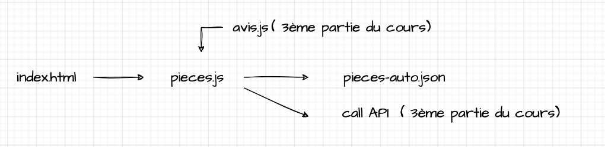
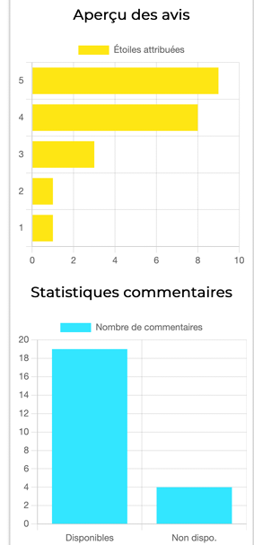

# Nouveau cours JS OC
**Skills developed**:
- Create a web interface from existing data
- Make a web page interactive
- Interact with a web service using an HTTP API
- Enrich your web pages with libraries
##
**Code Architecture:**
##

 
 
This project contains different branches to keep track of different code versions as the course progresses. 
##
**Start the project**: 
From "start-project" branch to "display-filter-and-sort" branch,nothing to install, just open the index.html file. 
- "start-project" branch: 
:point_right: [here](https://github.com/cla31/nveau-cours-js-oc/tree/start-project) 
- "Lists" branch: 
:point_right: [here](https://github.com/cla31/nveau-cours-js-oc/tree/Lists)
- "map" branch: 
:point_right: [here](https://github.com/cla31/nveau-cours-js-oc/tree/map)
- "display-filter-and-sort" branch: 
:point_right: [here](https://github.com/cla31/nveau-cours-js-oc/tree/display-filter-and-sort)
##
**Branches with API calls:**
##
From these code versions, the front-end communicates with the back-end.
**Set up and run Back-End**: 
With a terminal, go to the parent folder of the project of your web page and run the commands: 
 
`git clone https://github.com/OpenClassrooms-Student-Center/7697016-Back-End.git api-http ` 
`cd api-http ` 
`npm install ` 
 
Then, to run the server: 
`npm start` 
 
URL to access API resources: 
`http://localhost:8081/pieces` 
`http://localhost:8081/avis` 
 
Home page: 
`http://localhost:8081` 
- "server-response-processing" branch: 
:point_right: [here](https://github.com/cla31/nveau-cours-js-oc/tree/server-response-processing)

- "backup-datas-with-api" branch: 
:point_right: [here](https://github.com/cla31/nveau-cours-js-oc/tree/backup-datas-with-api)

- "local-storage" branch: 
:point_right: [here](https://github.com/cla31/nveau-cours-js-oc/tree/local-storage)
##
**Branch with Chart.js library:**
##
🚨 Remember to launch the server to run the library! 
- "using-library" branch: 
:point_right: [here](https://github.com/cla31/nveau-cours-js-oc/tree/using-library)

**How to install the library:** 
`npm install chart.js` 
**Overview charts:**
##

